# SVG Bicycle Drivetrain Generator

Generate pure SVG strings for bicycle cassettes, chainrings, chains, and full drivetrain layouts. It works in browsers, bundlers, Node.js, server renderers, edge runtimes, and old-school script tags because the runtime is just JavaScript math returning SVG text.

The generator understands pitch-radius sprocket geometry, pitch-locked chain layouts, native SVG drivetrain animation, and layered cassette rendering with transparent stack styles.

## Demos

### Real Cassette Previews

The transparent stack rendering is useful for inspecting cog spacing and tooth growth. These examples use real cassette ranges with more realistic metal finishes, plus one gold SRAM XX1 Eagle-style stack.

| Cassette | Tooth counts | Preview |
| --- | --- | --- |
| SRAM XX1 Eagle Gold | 10-12-14-16-18-21-24-28-32-36-42-52 | 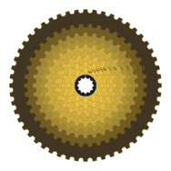 |
| Shimano XT M8100 | 10-12-14-16-18-21-24-28-33-39-45-51 | 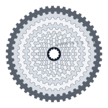 |
| SRAM GX Eagle | 10-12-14-16-18-21-24-28-32-36-42-52 | 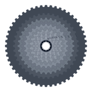 |
| Shimano 105 R7100 | 11-12-13-14-15-17-19-21-24-27-30-34 | 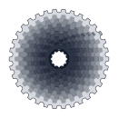 |
| Campagnolo Ekar | 9-10-11-12-13-14-16-18-21-25-30-36-42 | 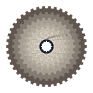 |

### Chains And Chainrings

Different chain colors and path patterns can be rendered independently from a full drivetrain.

| Silver straight chain | Silver flattop chain | Black wrap chain | Gold loop chain |
| --- | --- | --- | --- |
| 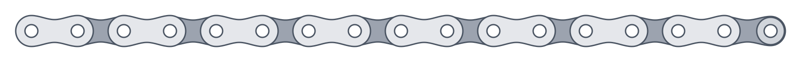 | 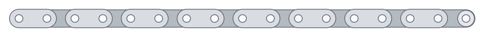 | 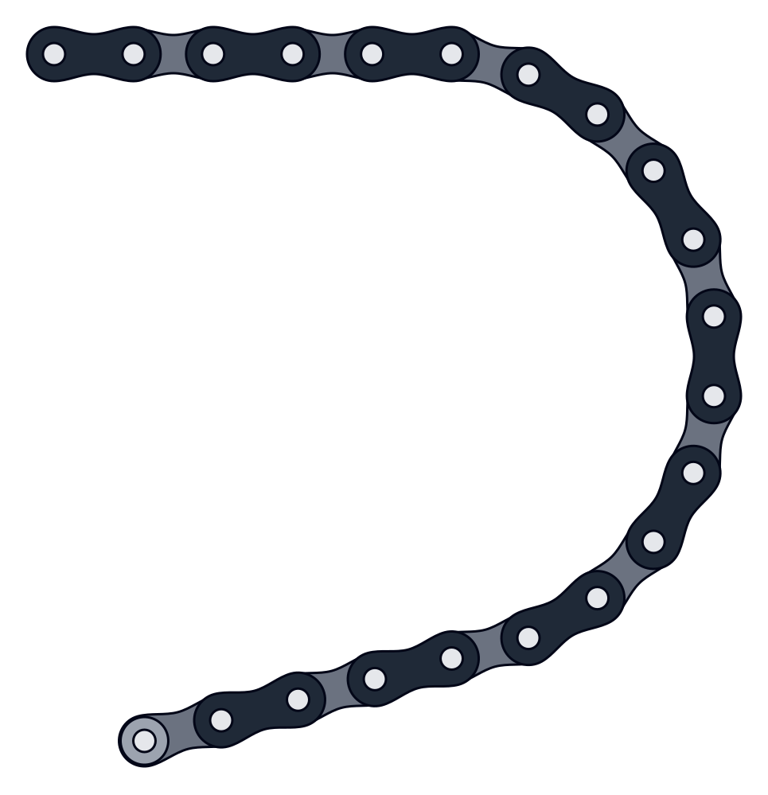 | 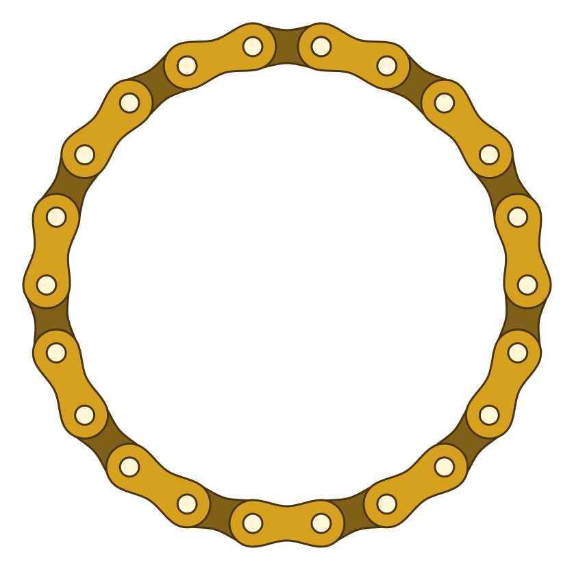 |

| 30T silver chainring | 34T black chainring | 40T alloy chainring |
| --- | --- | --- |
|  | 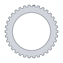 | 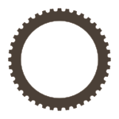 |

### Full Drivetrain

Both drivetrain demos use a 30T chainring with a SRAM Eagle 10-52 cassette in the third-largest cog, 36T. The animated version turns at 15 rpm.

**Static drivetrain**

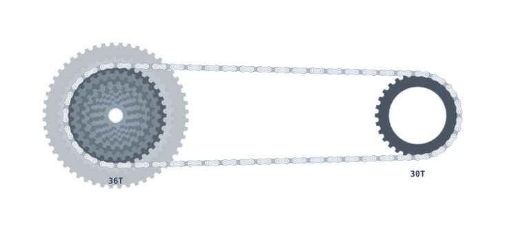

**Animated drivetrain**

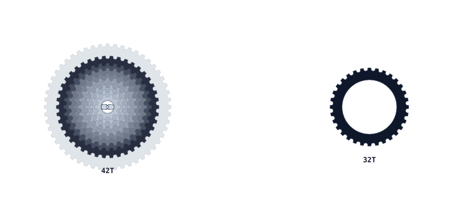

## Install from GitHub:

```bash
npm install github:ilslaoaycd/svg-bicycle-drivetrain-generator
```

For direct browser usage, build the package and include `dist/bicycle-drivetrain-svg.global.js`, or copy that file from a release.

## Quick Start

### ESM

```js
import {
  BicycleDrivetrainSVG,
  renderCassetteSvg,
  renderDrivetrainSvg
} from 'svg-bicycle-drivetrain-generator';

const cassette = renderCassetteSvg(
  [10, 12, 14, 16, 18, 21, 24, 28, 33, 39, 45, 51],
  { style: 'xrayCassette' }
);

const generator = new BicycleDrivetrainSVG();
const drivetrain = generator.drivetrain({
  chainring: 30,
  cogs: [10, 12, 14, 16, 18, 21, 24, 28, 32, 36, 42, 52],
  selectedCog: 36,
  chainstay: 435,
  style: 'blackGold',
  animation: { enabled: true, rpm: 15 }
});
```

### CommonJS

```js
const { renderChainringSvg } = require('svg-bicycle-drivetrain-generator');

const svg = renderChainringSvg(42, { style: 'blackGold' });
```

### Script Tag

```html
<div id="bike"></div>
<script src="./dist/bicycle-drivetrain-svg.global.js"></script>
<script>
  document.querySelector('#bike').innerHTML =
    BicycleDrivetrainSVG.renderDrivetrainSvg({
      chainring: 30,
      cogs: [10, 12, 14, 16, 18, 21, 24, 28, 32, 36, 42, 52],
      selectedCog: 36,
      chainstay: 435,
      style: 'blackGold',
      animation: { enabled: true, rpm: 15 }
    });
</script>
```

## API

### Facade

```js
const generator = new BicycleDrivetrainSVG({ pitch: 12.7 });

generator.cassette(cogs, options);
generator.chainring(teeth, options);
generator.chain(linkCount, pathType, options);
generator.drivetrain(options);
```

The facade is the easiest entry point. It wraps the lower-level classes and accepts style preset names directly.

### Convenience Functions

```js
renderCassetteSvg(cogs, options);
renderChainringSvg(teeth, options);
renderChainSvg(linkCount, pathType, options);
renderDrivetrainSvg(options);
```

### Named Classes

The package also exports `CassetteSVGGenerator`, `ChainringSVGGenerator`, `ChainSVGGenerator`, `DrivetrainSVGGenerator`, and `SprocketGeometry` for lower-level use.

## Options

### Cassette

```js
renderCassetteSvg([10, 12, 14, 16, 18, 21, 24, 28], {
  view: 'front',          // "front" or "side"
  direction: 'ltr',       // side view only: "ltr" or "rtl"
  style: 'classicSteel',
  styleConfig: {
    showText: true,
    layerOpacity: 0.3,
    selectedOpacity: 0.9
  }
});
```

### Chainring

```js
renderChainringSvg(42, {
  style: 'oilSlick',
  styleConfig: { showText: true }
});
```

### Chain

```js
renderChainSvg(18, 'wave', {
  style: 'raceRed',
  startLink: 'outer',
  flatTop: true,
  showPins: true,
  showRollers: true
});
```

Supported path types are `straight`, `curve`, `wave`, `wrap`, and `loop`.
Use `flatTop: true` for straight-edged chain plates like SRAM Flattop-style chains. It affects both inner and outer link outlines and works with every path type.

### Drivetrain

```js
renderDrivetrainSvg({
  chainring: 30,
  cogs: [10, 12, 14, 16, 18, 21, 24, 28, 32, 36, 42, 52],
  selectedCog: 36,
  chainstay: 435,
  showText: true,
  style: 'blackGold',
  styleConfig: {
    flatTopChain: true
  },
  animation: { enabled: true, rpm: 15 }
});
```

`chainstay` is in millimeters. When animation is enabled, the chainring, cassette, and chain use native SVG animation markup.
Set `styleConfig.flatTopChain` to `true` when full drivetrain renders should use flattop chain plates.

## Presets

### Drivetrain Presets

Use these with `renderDrivetrainSvg({ preset: 'name' })`:

- `compactRoad`
- `gravelWideRange`
- `mtbTenFiftyTwo`
- `trackFixie`
- `touringTripleInspired`

### Style Presets

Use these with any facade or convenience method:

- `classicSteel`
- `blackGold`
- `oilSlick`
- `blueprint`
- `raceRed`
- `ghostStack`
- `xrayCassette`

`ghostStack` and `xrayCassette` use transparent cassette layer defaults for inspection-style drawings.

## Runtime Design

Runtime code has no filesystem, DOM, network, Express, or Node-specific dependencies. Every render method returns a plain SVG string. You decide whether to write it to a file, send it from an API, inline it into HTML, or use it in a frontend component.

Build and example-generation scripts use Node.js, but the library runtime does not.

## Development

```bash
npm install
npm run build
npm run examples
npm test
```

The committed samples live in `examples/svg/`. Regenerate them after changing geometry, styles, or presets.

## License

MIT
