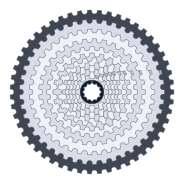
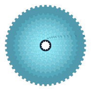
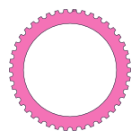
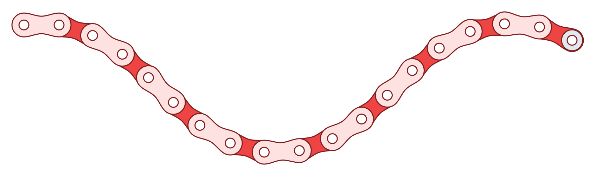

# SVG Bicycle Drivetrain Generator

Generate pure SVG strings for bicycle cassettes, chainrings, chains, and full drivetrain layouts. It works in browsers, bundlers, Node.js, server renderers, edge runtimes, and old-school script tags because the runtime is just JavaScript math returning SVG text.

The generator understands pitch-radius sprocket geometry, pitch-locked chain layouts, native SVG drivetrain animation, and layered cassette rendering with transparent stack styles.

## Demos

| Cassette front | Transparent cassette stack |
| --- | --- |
|  |  |

| Chainring | Chain wave |
| --- | --- |
|  |  |

| Static drivetrain | Animated drivetrain |
| --- | --- |
|  |  |

## Install

```bash
npm install svg-bicycle-drivetrain-generator
```

Or install from GitHub:

```bash
npm install github:ilslaoaycd/svg-bicycle-drivetrain-generator
```

For direct browser usage, build the package and include `dist/bicycle-drivetrain-svg.global.js`, or copy that file from a release.

## Quick Start

### ESM

```js
import {
  BicycleDrivetrainSVG,
  renderCassetteSvg,
  renderDrivetrainSvg
} from 'svg-bicycle-drivetrain-generator';

const cassette = renderCassetteSvg(
  [10, 12, 14, 16, 18, 21, 24, 28, 33, 39, 45, 51],
  { style: 'xrayCassette' }
);

const generator = new BicycleDrivetrainSVG();
const drivetrain = generator.drivetrain({
  preset: 'gravelWideRange',
  selectedCog: 33,
  style: 'oilSlick',
  animation: { enabled: true, rpm: 72 }
});
```

### CommonJS

```js
const { renderChainringSvg } = require('svg-bicycle-drivetrain-generator');

const svg = renderChainringSvg(42, { style: 'blackGold' });
```

### Script Tag

```html
<div id="bike"></div>
<script src="./dist/bicycle-drivetrain-svg.global.js"></script>
<script>
  document.querySelector('#bike').innerHTML =
    BicycleDrivetrainSVG.renderDrivetrainSvg({
      preset: 'mtbTenFiftyTwo',
      selectedCog: 42,
      style: 'ghostStack',
      animation: { enabled: true, rpm: 70 }
    });
</script>
```

## API

### Facade

```js
const generator = new BicycleDrivetrainSVG({ pitch: 12.7 });

generator.cassette(cogs, options);
generator.chainring(teeth, options);
generator.chain(linkCount, pathType, options);
generator.drivetrain(options);
```

The facade is the easiest entry point. It wraps the lower-level classes and accepts style preset names directly.

### Convenience Functions

```js
renderCassetteSvg(cogs, options);
renderChainringSvg(teeth, options);
renderChainSvg(linkCount, pathType, options);
renderDrivetrainSvg(options);
```

### Named Classes

The package also exports `CassetteSVGGenerator`, `ChainringSVGGenerator`, `ChainSVGGenerator`, `DrivetrainSVGGenerator`, and `SprocketGeometry` for lower-level use.

## Options

### Cassette

```js
renderCassetteSvg([10, 12, 14, 16, 18, 21, 24, 28], {
  view: 'front',          // "front" or "side"
  direction: 'ltr',       // side view only: "ltr" or "rtl"
  style: 'classicSteel',
  styleConfig: {
    showText: true,
    layerOpacity: 0.3,
    selectedOpacity: 0.9
  }
});
```

### Chainring

```js
renderChainringSvg(42, {
  style: 'oilSlick',
  styleConfig: { showText: true }
});
```

### Chain

```js
renderChainSvg(18, 'wave', {
  style: 'raceRed',
  startLink: 'outer',
  showPins: true,
  showRollers: true
});
```

Supported path types are `straight`, `curve`, `wave`, `wrap`, and `loop`.

### Drivetrain

```js
renderDrivetrainSvg({
  chainring: 40,
  cogs: [10, 12, 14, 16, 18, 21, 24, 28, 33, 39, 45, 51],
  selectedCog: 33,
  chainstay: 430,
  showText: true,
  style: 'classicSteel',
  animation: { enabled: true, rpm: 72 }
});
```

`chainstay` is in millimeters. When animation is enabled, the chainring, cassette, and chain use native SVG animation markup.

## Presets

### Drivetrain Presets

Use these with `renderDrivetrainSvg({ preset: 'name' })`:

- `compactRoad`
- `gravelWideRange`
- `mtbTenFiftyTwo`
- `trackFixie`
- `touringTripleInspired`

### Style Presets

Use these with any facade or convenience method:

- `classicSteel`
- `blackGold`
- `oilSlick`
- `blueprint`
- `raceRed`
- `ghostStack`
- `xrayCassette`

`ghostStack` and `xrayCassette` use transparent cassette layer defaults for inspection-style drawings.

## Runtime Design

Runtime code has no filesystem, DOM, network, Express, or Node-specific dependencies. Every render method returns a plain SVG string. You decide whether to write it to a file, send it from an API, inline it into HTML, or use it in a frontend component.

Build and example-generation scripts use Node.js, but the library runtime does not.

## Development

```bash
npm install
npm run build
npm run examples
npm test
```

The committed samples live in `examples/svg/`. Regenerate them after changing geometry, styles, or presets.

## License

MIT
